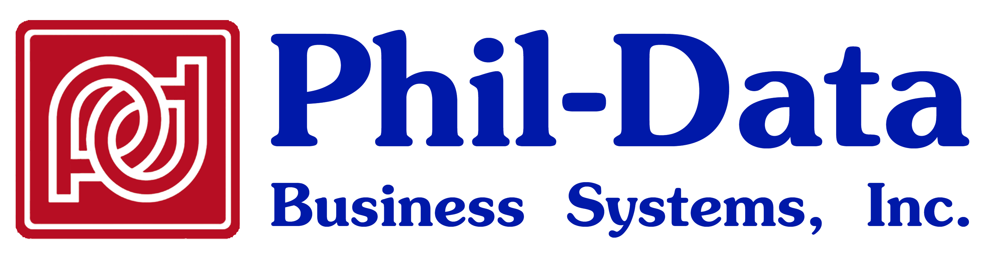

# Request Hub

Request Hub is a role-based request and activity management platform built with Django. It helps requestors, engineers, and administrators coordinate work, track SLA timelines, and monitor operational progress from a single web portal.



## UI Preview


## Table of Contents

- [Overview](#overview)
- [Core Features](#core-features)
- [Technology Stack](#technology-stack)
- [Project Structure](#project-structure)
- [Local Development Setup](#local-development-setup)
- [Docker Setup](#docker-setup)
- [Environment Variables](#environment-variables)
- [Database and Migrations](#database-and-migrations)
- [Running Tests](#running-tests)
- [Scheduled Jobs](#scheduled-jobs)
- [Deployment](#deployment)
- [Security Notes](#security-notes)
- [Troubleshooting](#troubleshooting)

## Overview

Request Hub provides:

- Role-aware dashboards for Requestor, Engineer, and Admin users
- Request lifecycle management from creation to completion
- SLA-aware monitoring and overdue visibility
- Engineer activity logging and reporting
- Built-in notification workflows and communication actions
- Dark mode and responsive UI behavior for desktop/mobile users

## Core Features

### Request Management

- Create and track requests with status, priority, engagement type, and due dates
- Assign engineers and backup engineers
- Manage request updates through role-appropriate actions

### Dashboard Insights

- Requestor dashboards with request metrics and report graphs
- Engineer dashboards with assigned/backup views and activity reporting
- Admin dashboard with sorting, filtering, and SLA indicators

### Activity Logs

- Engineer activity logging (hours, location, billable status, work details)
- Activity Report Graph tab for trend and distribution views

### Collaboration and Notifications

- In-app notification center for assignment and workflow updates
- Teams/Outlook integrations via action buttons where configured

## Technology Stack

- Backend: Django 4.2
- Database: PostgreSQL (recommended for production)
- Frontend: Django Templates + Bootstrap 5 + custom CSS/JS
- Containerization: Docker / Docker Compose
- Optional integrations: Azure Communication Services, Microsoft cloud services

## Project Structure

```text
accounts/            User/account management
hub/                 Core app: requests, activity logs, dashboards, reports
request_hub/         Django project settings and URL configuration
templates/           Shared and app templates
static/              CSS, images, and frontend assets
docs/                Deployment and operational documentation
```

## Local Development Setup

### 1) Create and activate virtual environment (Windows PowerShell)

```powershell
python -m venv .venv
.\.venv\Scripts\Activate.ps1
pip install -r requirements.txt
```

### 2) Configure environment

```powershell
Copy-Item .env.example .env
```

Update `.env` with your local values (database host/user/password, secrets, and optional service keys).

### 3) Run migrations

```powershell
python manage.py migrate
```

### 4) Start development server

```powershell
python manage.py runserver
```

Open: `http://127.0.0.1:8000/`

## Docker Setup

### Start services

```powershell
docker compose up --build
```

### Run migrations in container

```powershell
docker compose exec web python manage.py migrate
```

### Stop services

```powershell
docker compose down
```

## Environment Variables

Use `.env` to store runtime configuration. Typical values include:

- `SECRET_KEY`
- `DEBUG`
- `ALLOWED_HOSTS`
- `DB_NAME`
- `DB_USER`
- `DB_PASSWORD`
- `DB_HOST`
- `DB_PORT`
- Optional integration settings (email/Azure/etc.)

Microsoft Graph (MSAL) settings for phildata tenant:

- `PHILDATA_TENANT_ID`
- `PHILDATA_CLIENT_ID`
- `PHILDATA_CLIENT_SECRET`
- `PHILDATA_DOMAIN` (default: `phildata.com`)
- `PHILDATA_GRAPH_SCOPE` (default: `https://graph.microsoft.com/.default`)

Do not commit real secrets, tokens, passwords, or connection strings.

## Database and Migrations

Apply migrations:

```powershell
python manage.py migrate
```

Create new migrations after model changes:

```powershell
python manage.py makemigrations
python manage.py migrate
```

## Running Tests

```powershell
python manage.py test
```

## Scheduled Jobs

SLA monitoring command:

```powershell
python manage.py check_sla
```

In containerized environments:

```powershell
docker compose exec web python manage.py check_sla
```

Run this on a daily schedule using Task Scheduler, cron, or your preferred scheduler.

Microsoft Graph tenant authentication and user fetch command:

```powershell
python manage.py fetch_phildata_users --limit 25 --sample 10
```

To include all users returned by Graph (not only `@phildata.com`):

```powershell
python manage.py fetch_phildata_users --include-non-domain
```

## Deployment

For Azure App Service container deployment guidance, see:

- [docs/azure-app-service-deployment.md](docs/azure-app-service-deployment.md)

## Security Notes

- Keep `.env` out of source control
- Rotate any exposed keys immediately
- Use strong passwords and enforce least privilege
- Prefer secret stores for production credentials (not plaintext files)

## Troubleshooting

### App does not start locally

- Verify Python and pip are installed and on PATH
- Recreate `.venv` and reinstall dependencies
- Confirm `.env` values and database connectivity

### Migration errors

- Ensure database service is running
- Confirm credentials/host/port in `.env`
- Run `python manage.py showmigrations` to inspect migration state

### Static files/UI issues

- Clear browser cache (Ctrl+F5)
- Rebuild containers if running via Docker

---

If you want, I can also add a **Contributing Guide**, **API/URL map**, and a **changelog section** to this README.
